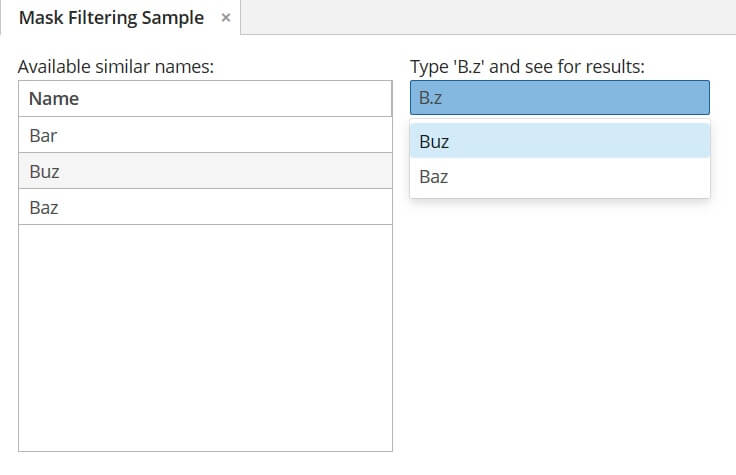

# SuggestionField mask filtering

The sample demonstrates how mask filtering can be implemented with SuggestionField.

Based on CUBA 7.0.1

## Solution

We can consider a query with dots as RegExp:

```java
public class SampleScreen extends Screen {

    @Inject
    private CollectionContainer<NameEntity> names;

    // Declaratively install SearchExecutor for SuggestionField
    @Install(to = "suggestionField", subject = "searchExecutor")
    private List suggestionFieldSearchExecutor(String query, Map<String, Object> params) {
        Pattern likeQuery = Pattern.compile(query);
        return names.getItems()
                .stream()
                .filter(item -> likeQuery.matcher(item.getName()).matches())
                .collect(Collectors.toList());
    }
}
```

## Result

